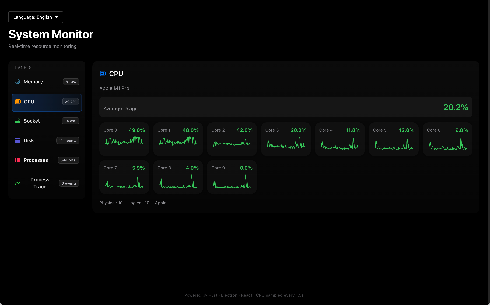
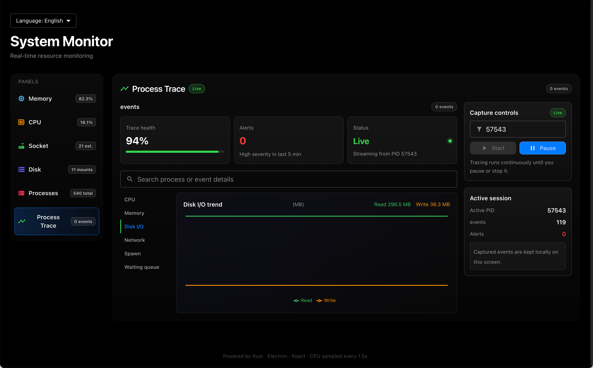

# System Monitor

[中文文档](./README.md) | **English**

A system monitoring application built with Electron + React + TypeScript, using the `js-query-system-info` npm package to retrieve system information.




## Features

- **Memory Monitoring**: Real-time display of memory usage, available memory, and usage rate
- **CPU Monitoring**: Display CPU model, core count, frequency, and per-core usage rates
- **Disk Monitoring**: Display usage status of each disk partition
- **Network Monitoring**: Display TCP/UDP connection status statistics and connection list
- **Process Monitoring**: Display system process list and memory usage
- **Process Tracking** (Key Highlight):
  - Real-time tracking of target process CPU usage with millisecond-level sampling precision
  - Real-time tracking of target process disk I/O read/write rates and operation counts
  - Real-time tracking of target process network I/O send/receive traffic and packet statistics
  - Real-time tracking of target process network send/receive queue depth and latency
  - Real-time tracking of complete process tree including all child process information
  - Support for tracking multiple processes simultaneously for comparative analysis
  - Historical data charts for visualizing resource usage trends
  - Ideal for performance tuning, bottleneck diagnosis, and anomaly detection scenarios

## Tech Stack

- **Frontend**: React 18 + TypeScript + Vite
- **UI**: Material UI + Recharts
- **Desktop Framework**: Electron 28
- **System Information**: js-query-system-info (Rust NAPI-RS bindings)

## Project Structure

```
system-monitor/
├── src/
│   ├── main/
│   │   ├── main.ts          # Electron main process
│   │   ├── native-worker.ts # Native module Worker
│   │   └── preload.ts       # Electron preload script
│   └── renderer/
│       ├── components/       # React components
│       │   ├── Dashboard.tsx
│       │   ├── MemoryPanel.tsx
│       │   ├── CpuPanel.tsx
│       │   ├── DiskPanel.tsx
│       │   ├── SocketPanel.tsx
│       │   └── ProcessPanel.tsx
│       ├── hooks/           # React Hooks
│       │   └── useSystemInfo.ts
│       ├── styles/          # Theme styles
│       │   └── theme.ts
│       ├── types/           # TypeScript types
│       │   └── electron.d.ts
│       ├── App.tsx
│       └── main.tsx
├── index.html
├── package.json
├── tsconfig.json
└── vite.config.ts
```

## Installation and Running

### Prerequisites

1. Node.js 18+
2. Yarn

### Quick Start (Recommended)

**macOS/Linux:**
```bash
cd system_monitor_gui
./scripts/start-dev.sh
```

**Manual Steps:**

```bash
# 1. Enter project directory
cd system_monitor_gui

# 2. Install dependencies
yarn install

# 3. Run in development mode
yarn dev
```

### Troubleshooting

**Q: Error "Cannot find module js-query-system-info"**

A: Make sure dependencies are installed:
```bash
yarn install
```

**Q: Error "Native module not loaded"**

A: Check if the npm package is correctly installed:
```bash
ls node_modules/js-query-system-info/
```

**Q: Application doesn't open after build**

A: Check Electron console output to confirm the native module loading path is correct.

## Interface Description

### Top Area

- **MEMORY Panel**: Display total memory, used, available, and free memory with usage progress bar
- **CPU Panel**: Display CPU model, physical/logical core count, frequency, with per-core usage chart
- **NETWORK Panel**: Display network connection statistics (total, established, listening, etc.) and connection list

### Bottom Area

- **DISK Panel**: Display usage status and progress bar for each disk partition
- **PROCESSES Panel**: Display top 15 processes by memory usage

## Theme Style

Adopts a cyberpunk/tech-inspired design style:

- **Primary Colors**: Cyan (#00f0ff), Purple (#ff00ff)
- **Accent Colors**: Green (#00ff88), Orange (#ffaa00), Red (#ff3366)
- **Fonts**: Orbitron (headings) + Roboto (body text)
- **Effects**: Glowing shadows, gradient backgrounds, scan line effects

## Data Refresh

- System information refreshes automatically every 2 seconds
- CPU usage samples every 1 second
- Memory, network, and process data sync in real-time

## Development Guide

### IPC Communication

The main process communicates with the renderer process via IPC, providing the following API:

```typescript
window.systemInfo.getSystemSummary()  // Get complete system summary
window.systemInfo.getMemoryInfo()     // Get memory information
window.systemInfo.getCpuInfo()        // Get CPU information
window.systemInfo.getCpuUsage()       // Get CPU usage
window.systemInfo.getDisks()          // Get disk information
window.systemInfo.getSocketSummary()  // Get network statistics
window.systemInfo.getProcesses()      // Get process list
window.systemInfo.getConnections()    // Get connection list
```

### Adding New Panels

1. Create a new component in `src/renderer/components/`
2. Import and add to the layout in `Dashboard.tsx`
3. Add new IPC handlers to `main.ts` as needed

## Build and Release

```bash
# Build for all platforms
yarn build

# Output directory: release/
```

## License

MIT
